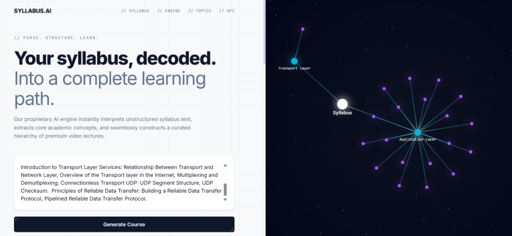
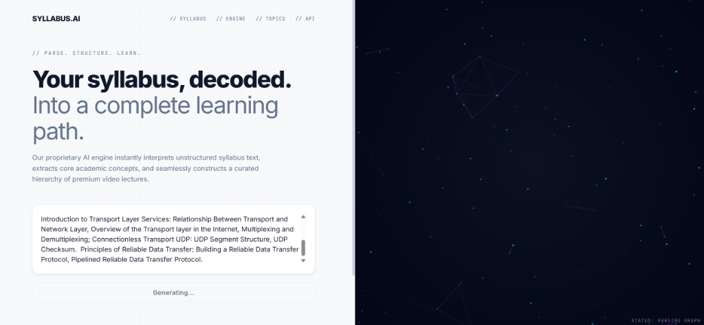
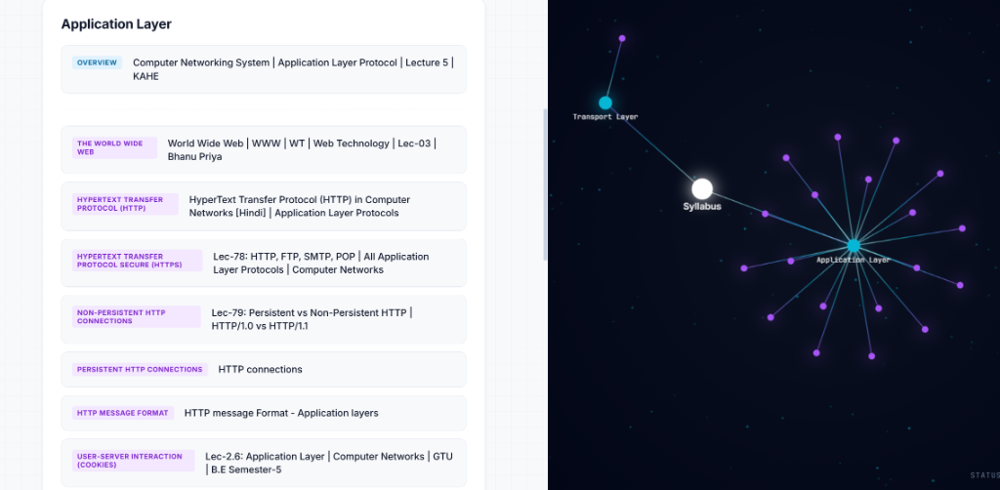

# Syllabus AI: Neural Learning Matrix

**Syllabus AI** is a professional-grade platform designed to deconstruct unstructured academic syllabi and transform them into a cinematic, structured learning journey. Powered by **Gemini AI** and a high-performance **Neural Visualization Engine**, it bridges the gap between raw text and deep understanding.

## 📸 Interface Preview

  
   

  

---

## 🔥 The Vision

In a world of information overload, **Syllabus AI** acts as a cognitive filter. It doesn't just list resources—it builds a **Knowledge Hierarchy**.
1.  **Semantic Analysis**: Intelligent parsing of raw text into logical topics and thematic clusters.
2.  **Resource Discovery**: Automated curation of the highest-rated educational videos globally.
3.  **Knowledge Mapping**: Visualizing the entire learning path as a dynamic, physics-driven neural network.

## 🎨 The Aesthetic

The platform features a **High-Contrast "Split-Console" Interface**:
-   **LEFT SIDE (The Analyst)**: A pristine, light-themed minimal console for input and curriculum management.
-   **RIGHT SIDE (The Matrix)**: A dark, cinematic neural workspace where knowledge is visualized in real-time.
-   **Precision UI**: Engineered with brutalist principles, tech-bracket corners, and fluid micro-animations.

---

## 🧠 Technology Stack

### // INTELLIGENCE
-   **GenAI Engine**: Gemini 2.5 Flash for high-speed, structured semantic parsing.
-   **Knowledge Extraction**: Multimodal understanding of diverse syllabus formats.

### // VISUALIZATION
-   **Physics Engine**: Custom-built HTML5 Canvas force-directed graph.
-   **Neural FX**: Neon glowing nodes with active path highlighting and edge-pulse energy flow.

### // BACKEND
-   **Core**: FastAPI (Python) for ultra-low latency API orchestration.
-   **Retrieval**: Intelligent YouTube Data API v3 integration with curated ranking algorithms.

---

## 🛠️ Performance Features
-   **Active Settling Physics**: Smooth, drifting graph movement without jitter.
-   **Neon Hover Interaction**: Dynamic glow and connectivity feedback on node interaction.
-   **Brutalist Controls**: Precise, engineered UI components for professional use.

---

## ⚖️ License
Internal Use / Research Prototype. All external content found via the engine remains the property of its respective creators.
